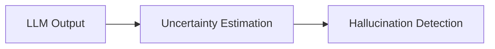

---
tags:
  - UQ
  - hallucination
---
# Feature Test

This intentionally public development fixture contains synthetic examples only.

## Table and code

| Signal | Meaning |
| --- | --- |
| Confidence | Estimated correctness |
| Entropy | Predictive uncertainty |

```python
def entropy_term(p):
    return -p * math.log(p)
```

## Admonition and footnote

!!! note "Synthetic example"
    This is a rendering check, not a research finding.

??? tip "Expandable detail"
    Collapsible content is visible when opened.

A portable footnote example.[^fixture]

[^fixture]: Test-only reference; no private material.

- [x] Public fixture
- [ ] Future research content

## Math

Inline entropy: $H(Y)$.

$$
H(Y) = -\sum_y p(y)\log p(y)
$$

## Mermaid



## Internal links

Read [Uncertainty Quantification](uncertainty/index.md) or return [Home](index.md).
