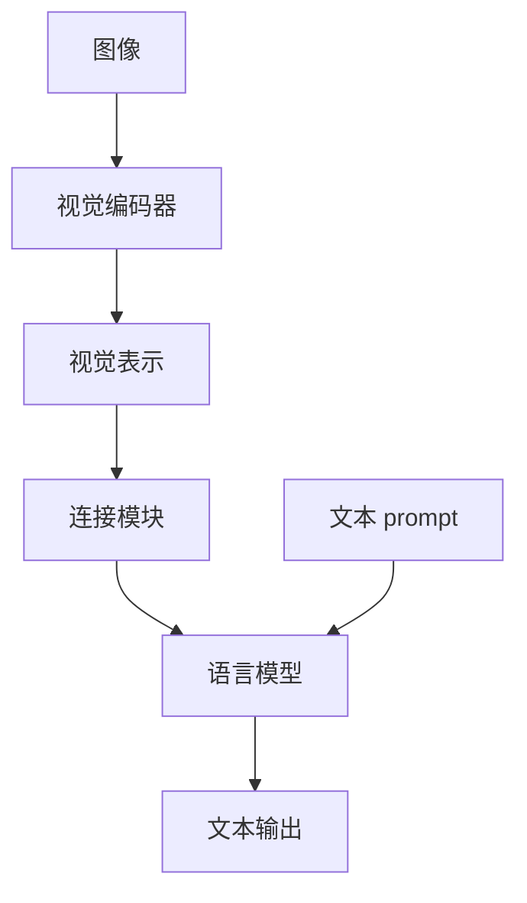

---
tags:
  - foundations
  - vlm
  - lvlm
---

# LVLM

LVLM 将视觉输入与 LLM 的语言处理能力结合，使回答可以同时以图像和文本为条件。本页主要讨论输入图像及 prompt、输出文本的生成式系统。这个工作范围不意味着所有 VLM 都采用语言生成架构，也不以某个统一参数规模界定“大型”。

## 一个最小概念结构

下图展示一种常见的模块化理解方式。视觉信息和文本指令通过不同入口进入系统，随后共同影响语言输出。

这是概念结构，不是所有 LVLM 必须遵循的固定流水线。箭头表示信息传递，不代表训练阶段；连接和交互也可能分布在多个层中。理解一个具体模型时，需要回到论文确认视觉信息在哪里注入、哪些模块被更新，以及语言模型实际能访问哪些表示。

## 视觉编码器（Vision Encoder）

视觉编码器把图像转换为可供后续网络处理的特征或 embedding。输出可以是一组 patch 特征，也可以经过汇聚或其他处理。patch 是图像的局部块，不必恰好对应一个完整对象；一个对象可能跨越多个 patch，同一 patch 也可能含有不同内容。

LVLM 可以复用预训练的视觉编码器。比如 [Liu et al. (2023)](https://proceedings.neurips.cc/paper_files/paper/2023/hash/6dcf277ea32ce3288914faf369fe6de0-Abstract-Conference.html "文献引用") 使用视觉 Transformer（Vision Transformer，ViT）编码图像，再把视觉特征接入语言模型。这里不展开 ViT 的完整结构，只需知道编码器输出的是计算得到的表示，而不是一份已经保证正确的对象清单。

对于“有没有狗”“狗是什么颜色”“狗在椅子的哪一侧”，需要的视觉信息粒度不同。因此检查编码器时，除输出维度外，还应考虑空间位置、局部属性及关系信息是否能供后续任务使用。具体信息保留问题见 [多模态表征](multimodal-representation.md)。

## 连接模块（Cross-modal Connector）

连接模块使视觉特征能够被语言侧处理。它可能调整维度、组织视觉 token，或通过交互机制提取语言侧可用的信息。维度相同只是接口兼容的一部分，并不证明两个模态的语义已经对应。

[Liu et al. (2023)](https://proceedings.neurips.cc/paper_files/paper/2023/hash/6dcf277ea32ce3288914faf369fe6de0-Abstract-Conference.html "文献引用") 提出的语言视觉助手（Large Language and Vision Assistant，LLaVA）在原始版本中使用线性投影连接视觉特征与语言 embedding 空间。[Li et al. (2023a)](https://proceedings.mlr.press/v202/li23q.html "文献引用") 的 BLIP-2 则通过查询 Transformer（Querying Transformer，Q-Former）连接冻结的图像编码器和语言模型。两者说明连接模块可以有不同结构；不能把某个版本的设计推广到全部模型。

更一般的实现还可以采用适配器（Adapter）或跨注意力（Cross-Attention）机制。关键是确定信息如何进入计算，而不是只根据“projector”或“adapter”的名称推断模型已经具有视觉理解能力。

## 语言模型承担什么

语言模型在视觉条件和文本上下文的共同作用下产生 logits，继续进行逐 token 生成。指令理解、答案组织和推理相关处理也发生在这一过程中，但结构图本身不保证这些能力在每个样本上成立。

视觉表示通常是连续向量，不必先转写成自然语言描述；文本输出仍通过 [自回归生成](../language-models/autoregressive-generation.md) 所述的机制产生。因此，语言生成概率可以用于观察输出偏好，却不能单独证明某一句话来自正确的图像区域。

同样，流畅的解释不等于可验证的视觉推理过程。要判断“红色”“左侧”或“两个”等内容是否有依据，需要把语言表达与相应图像证据联系起来，而不只检查语法完整性。

## 训练阶段不是统一配方

模型可能经历视觉语言预训练、指令微调和面向任务的 fine-tuning。各阶段使用的数据、目标与可训练模块可以不同，阶段名称相近也不意味着操作相同。

LLaVA 原论文先训练连接投影，再在视觉指令数据上更新投影和语言模型；视觉编码器保持冻结（[Liu et al., 2023](https://proceedings.neurips.cc/paper_files/paper/2023/hash/6dcf277ea32ce3288914faf369fe6de0-Abstract-Conference.html "文献引用")）。BLIP-2 的两阶段预训练则围绕表示学习与视觉条件生成展开（[Li et al., 2023a](https://proceedings.mlr.press/v202/li23q.html "文献引用")）。这些是具体方案的说明，不是必须依次执行的通用要求。

阅读训练描述时，应区分“利用图文配对学习对应关系”和“利用问答或对话学习响应指令”。二者可以配合，但不能仅凭完成其中一个阶段，就断言细粒度视觉依据已经得到保证。

## 为什么结构与可信性有关

视觉输入增加了新的核查环节：相关信息有没有进入表示，连接机制有没有让语言侧使用它，最终表达是否获得图像支持。[Li et al. (2023b)](https://aclanthology.org/2023.emnlp-main.20/ "文献引用") 在所评估模型中发现，生成内容可能包含图像中不存在的对象，且错误与对象在指令中的出现频率及共现关系有关。

这一结果支持关注语言先验与视觉证据的关系，但不能由单个错误反推某一模块必然失效。模型可能利用语言中的常见关系作出猜测；是否忽略图像、哪个阶段影响最大，仍需针对具体模型验证。

后续 UQ 可以同时考察输出分布、内部表示和视觉证据。本页只界定这些信息来自哪里；对应关系见 [跨模态对齐](cross-modal-alignment.md)，具体证据联系见 [视觉定位](visual-grounding.md)。

## 参考文献

- Liu, H., Li, C., Wu, Q., Lee, Y. J. (2023). *Visual Instruction Tuning*. Advances in Neural Information Processing Systems, 36, 34892–34916. [Paper](https://proceedings.neurips.cc/paper_files/paper/2023/hash/6dcf277ea32ce3288914faf369fe6de0-Abstract-Conference.html)
- Li, J., Li, D., Savarese, S., Hoi, S. (2023a). *BLIP-2: Bootstrapping Language-Image Pre-training with Frozen Image Encoders and Large Language Models*. Proceedings of the 40th International Conference on Machine Learning, PMLR 202, 19730–19742. [Paper](https://proceedings.mlr.press/v202/li23q.html)
- Li, Y., Du, Y., Zhou, K., Wang, J., Zhao, W. X., Wen, J.-R. (2023b). *Evaluating Object Hallucination in Large Vision-Language Models*. EMNLP, 292–305. [Paper](https://aclanthology.org/2023.emnlp-main.20/)
