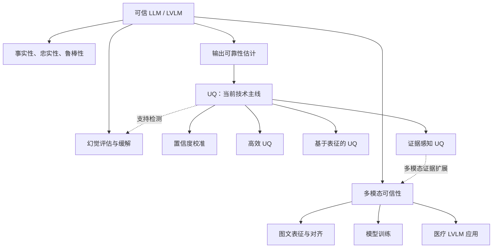

---
tags:
  - research-overview
  - trustworthiness
  - uq
  - multimodal
---

# 研究路线图

这张图展示研究方向之间的关系。整体范围是 LLM 与 LVLM 的可信性；UQ 是当前主要技术线。图中的关系用于组织研究，不表示方法已完成，也不构成固定时间安排。

图中将事实性、忠实性与鲁棒性合并为可信性目标，将幻觉评估与缓解作为问题方向。UQ 下的置信度校准、高效 UQ（Efficient UQ）、基于表征的 UQ（Representation-based UQ） 与证据感知 UQ（Evidence-aware UQ） 表示当前关注的相互关联的方向。

实线表示研究范围中的包含或展开关系，虚线表示可能的技术联系。图中只保留理解研究结构所需的关系，不穷尽所有方向之间的联系。

整体范围由可信性目标约束。幻觉评估与缓解、输出可靠性估计，以及多模态可信性分别保留位置，便于长期研究围绕不同问题展开。图文表征与对齐、模型训练也可以形成独立的技术路线。长期边界见[研究范围（Research Scope）](research-scope.md)。

评估贯穿这些方向：可信性目标决定需要检查什么，方法比较说明技术能提供什么信号，应用任务检验这些信号能否满足具体要求。图中省略单独的评估节点，以保持主要关系清楚。

当前工作从输出可靠性估计进入 UQ，重点考察不确定性信号怎样服务于幻觉或错误检测。校准关注置信度（Confidence）与正确性的关系，高效 UQ 关注计算代价，表征方向关注模型内部信息，证据方向关注输入或外部信息的作用。这些方向可以交叉，同一研究可以同时涉及多个方面。

未来向多模态扩展时，可以研究外部证据（External Evidence）和多模态证据（Multimodal Evidence）如何与不确定性信号结合。图中的虚线保留了这条联系，同时将多模态可信性直接放在整体范围之下，以体现它原本具有的长期研究地位。

医疗 LVLM 位于应用层。进入这一场景后，需要结合医学图像、文本与领域知识重新检查方法的适用性。是否扩展、先选择什么任务，以及哪些问题需要继续收敛，由[研究问题（Research Questions）](research-questions.md)和[当前研究重点（Current Focus）](current-focus.md)说明。
